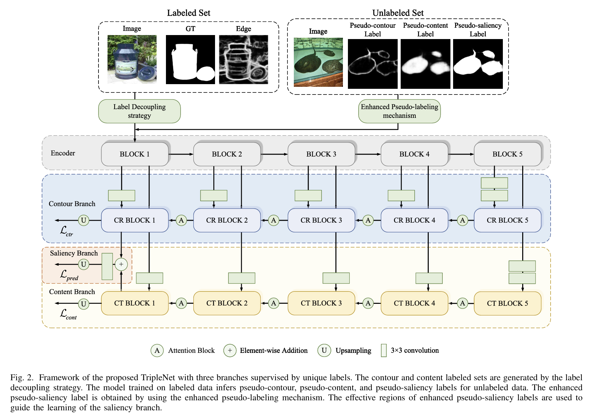
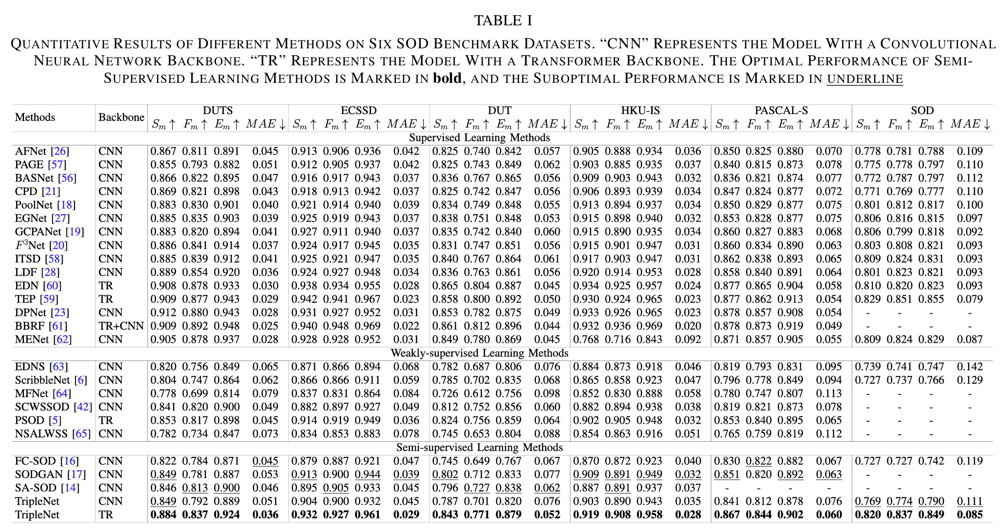

## <p align=center> TripleNet：Exploiting Complementary Features and Pseudo-Labels for Semi-Supervised Salient Object Detection  (TIP 2025) </p>
####  Liyuan Chen，Ming-Hsuan Yang, Jian Pu，Zhonglong Zheng </sup>


<font size=7><div align='center' > <a href=https://ieeexplore.ieee.org/abstract/document/11142954>**Paper**</a> | [**Training**](#training) | [**Testing**](#Testing) | [**Pre-trained Model**](#training)  </div></font>




## Abstract
Due to the limited output categories, semi-supervised salient object detection faces challenges in adapting conventional semi-supervised strategies. To address this limitation, we propose a multi-branch architecture that extracts complementary features from labeled data. Specifically, we introduce TripleNet, a three-branch network architecture designed for contour, content, and holistic saliency prediction. The supervision signals for the contour and content branches are derived by decomposing the limited ground truths. After training on the labeled data, the model produces pseudo-labels for unlabeled images, including contour, content, and salient objects.
By leveraging the complementarity between the contour and content branches, we construct coupled pseudo-saliency labels by integrating the pseudo-contour and pseudo-content labels, which differ from the model-inferred pseudo-saliency labels. We further develop an enhanced pseudo-labeling mechanism that generates enhanced pseudo-saliency labels by combining reliable regions from both pseudo-saliency labels. Moreover, we incorporate a partial binary cross-entropy loss function to guide the learning of the saliency branch to focus on effective regions within the enhanced pseudo-saliency labels, which are identified through our adaptive thresholding approach. Extensive experiments demonstrate that the proposed method achieves state-of-the-art performance using only 329 labeled training images.


## Dataset configuration
- For the training setup, update the `--training_path` parameter in the `config.py` file to your training data path, e.g., `training_path='./your_path/DUTS/'`.
- For the testing, update the `--test_dataset_root` parameter in the `config.py` file to point to your testing data path, e.g., `test_dataset_root='./your_testing_data_path/'`.


## Training

```shell
    cd src
    python train.py for supervised setting    or    python train_semi.py for semi-supervised setting
```
- `Swin Transformer` is used as the backbone, and `DUTS-TR` is used to train the model. You can replace it with other networks and backbones.
- `batch=8`, `epoch=30` for supervised-supervised setting or `epoch=50` for semi-supervised setting. 
- After training, the result models will be saved in `./experiments/SOD_vitb_rn50_384_6e-05_swin_REMOVE/models/` folder.


## Testing

```shell
    cd src
    python test.py
```
- After testing, saliency maps of `PASCAL-S`, `ECSSD`, `HKU-IS`, `DUT-OMRON`, `DUTS-TE` will be saved in `./results_mean/` folder.


## Result

+ Comparison with the previous state-of-the-art methods with different datasets:




